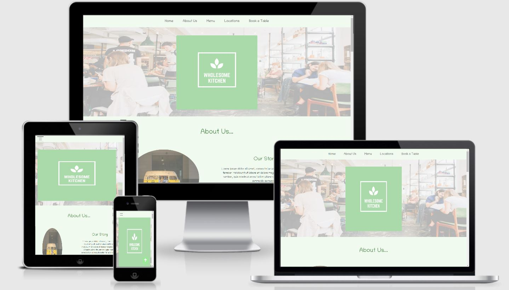

# Green Kitchen Cafe

Live website: http

A webpage for a fictional vegan cafe chain - "Green Kitchen Cafe". The main aim of this webpage is for customers / potential customers to learn more about the cafe chain.
 
# UX
 
### Who this website is for:
* This website is for customers / potential customers of the Green Kitchen Cafe chain.

### What they want to achieve:
* They want to learn more about Green Kitchen Cafe, read the menus on offer, find the cafe location closest to them and potentially book a table.

### This project is the best way to help them achieve these things because:
* The website is easy to navigate and uses a clear layout to display each of the above items.
* Each section of the page is easily accessable through the navigation bar which is fixed to the top of the page. 
* The site gives the user background information in the 'About Us' section, and then goes on to give detailed information on the cafes menu and location.
* The 'Book a Table' section allows the user to request a table at any of the cafes 4 locations. After requesting a table an email is generated, which allows the owner to confirm/reject the customers booking.

## User Stories:
1.	As a user, I want to learn more about the café, and read some background information to get a feel for the company.
2.	As a user, I want to view the cafes menu and see what items are on offer for breakfast, lunch, drinks and dessert at the café.
3.	As a user, I want to see where the cafes are located on a map. I want to be able to see the cafes exact location so that I can decide which one I would like to visit.
4.	As a user, I want to be able to be able to contact the company to reserve a table. I would like to be able to select the cafe location convenient for me, and then select my preffered date and time.
5.  I would also like to be able to contact an individual cafe location should I have any queries.

## Design 
- Color Scheme - I decided on using a green and white color scheme for the webpage to convey a sense of balance, health and simplicity. These connotations tie in with the business model of the company, which is a wholesome, vegan cafe.
    - #4A8646 - 'Middle Green'  
    - #F0FAEF - 'Mint Cream'
    - #F5F5F5 - 'Cultured'
    - #9BE89B - 'Granny Smith Apple' 

- Typography 
    - I chose the Google Font 'Chilanka' for the main font of the page. I chose this everyday handwriting style as it ties in with the casual style of the business. 

## Wireframes:
[desktop](https://github.com/EimearCunningham/Milestone2/blob/master/wireframes/desktop-wireframe.pdf)

[tablet](https://github.com/EimearCunningham/Milestone2/blob/master/wireframes/tablet-wireframe.pdf)

[mobile](https://github.com/EimearCunningham/Milestone2/blob/master/wireframes/mobile-wireframe.pdf)

# Features
### Header
* Navigation Bar - A fixed-top navigation bar with a link to each section of the page. The fixed-top navigation bar gives the user the option to go to a different section of the site at any time. Smooth scroll is used throughout the page for a clean finish.
* Hero Image with text overlay - Responsive image of cafe interior with cafe logo placed over the image. Canva was used to design the logo.

### About Us Section 
* 3 images (Our story, our founders, our team), with an on scroll function which shows corresponding text when users scroll to a certain point. This interactivity makes the page more intruiging for the user.

### Menus Section
* Menu with 4 tabs - Breakfast, lunch, desserts and drinks. Users can easily select a tab and see relevant menu items. The tabbed menu means that users do not have to search through all of the menu items to find what they are looking for.

### Locations Section
* Google Maps API used to display a map with a marker for each cafe location. When a location is clicked on, more information about the location is shown (Cafe address and contact information)

### Book a Table Section
* Form to book a table in any of the chains locations. EmailJS was used to add functionality which sends an email to the cafe admin when a user wants to book a table. Becasue this is a fictional website the email is sent to my personal email.
* Form validation was added using Javascript to ensure to blank fields are submitted, and to add custom error messages for each input.
* I decided to write the validation code myself, rather that use HTML5 'Required' attribute. I did this as I think custom error messages are more user friendly.

### Page Footer
* Footer with contact information and social media links. 

### Features Left to Implement
* When requesting to book a table, certain times that are booked up / not available could be blocked out to prevent the user from booking. Because this is a fictional site this is not yet possible to implement.

# Technologies Used
## Languages, frameworks and libraries used
* HTML5, CSS3 and Javascript were the programming languages used for this project.
* [jQuery](https://jquery.com/)- jQuery was used in the 'About Us' section to create a scroll function.
* [Bootstrap](https://getbootstrap.com/) - Bootstrap framework was used throughout to add responsiveness.
* [Hover.css](https://ianlunn.github.io/Hover/) - Hover.css - Added interactivity to social media icons in the footer.
* [Hover.css](https://fontawesome.com/) - Font Awesome - Used to add contact and social media icons to the footer.

## Other technologies used
* [Coolers.co](https://coolors.co/) - Coolers was used as part of the planning process, to select the various colors for the page.
* [Unsplash.com](https://unsplash.com/Unsplash.com) - Provided all images used.
* [Google Maps API](https://developers.google.com/maps/documentation/javascript/overview) -Used to provided map with locations of cafes.
* [EmailJS](https://www.emailjs.com/) - Added functionality to the 'Book a Table' form. 
* [Canva](https://www.canva.com/en_gb/)- Used to design logo.
* [Am I Responsive](http://ami.responsivedesign.is/) - Used to create responsive.JPG for README.
* [Balsamiq](https://balsamiq.com/wireframes/) - Desktop app used to create wireframes.
* [Favicon Generator](https://www.favicon-generator.org/) - Used to create favicon for page.
# Testing

# Deployment
This project was deployed using GitHub pages.

## To deploy this page I followed these steps:
1. Go to GitHub.com and log into account.
2. From the list of repositories to the left of the page, select EimearCunningham/Milestone1.
3. Once the repository is open, select the "Settings" button.
4. Scroll down to the "GitHub Pages" section.
5. Select the drop-down box which reads "none".
6. Select the Branch Master option, then save.
7. Refresh the page and then scroll back down to the "GitHub" pages section. Here you will find the link to the deployed site - https://eimearcunningham.github.io/Milestone1/

## To run this project locally: Clone from GitHub
1. Go to the project repository
2. Above the list of files, select the green "Code" drop-down button.
3. Under "Clone with HTTPS", click the "copy" icon.
4. Open Git Bash.
5. Change the current working directory to the location where you want the cloned directory.
6. Type "git clone", and then paste the URL you copied earlier.
7. Press Enter. Your local clone will be created.

# Credits

## Code
* Code for scroll to top button is from https://www.w3schools.com/howto/howto_js_scroll_to_top.asp , and then customised to suit my webpage.
* Code Institute course matierial was the main source used to set up EmailJS.
* Main source for tabbed menu code - [Nsquared Coding Tutorial](https://www.youtube.com/watch?v=irxE-MAdR_M)
* Main source for form validation code - [Florin Pop Tutorial](https://www.youtube.com/watch?v=rsd4FNGTRBw&t=1511s)
* Regex used in form validation was found on w3resource.com and stackoverflow.com
## Content
* Text used for menu items retreived from https://deliciouslyella.com/wp-content/uploads/2019/06/Deliciously_Ella_deli_menu.pdf
* Text used in 'About Us' section derived from https://deliciouslyella.com/about/ and https://riversidecafeperth.com.au/our-team/
## Media
* All images used are from [Unsplash.com](https://unsplash.com/Unsplash.com)
## Acknowledgements
* Code Institute Slack channel for the constant encouragement and support
* My mentor, Can Sucullu for his continued support

**This site is for educational purposes only** 
