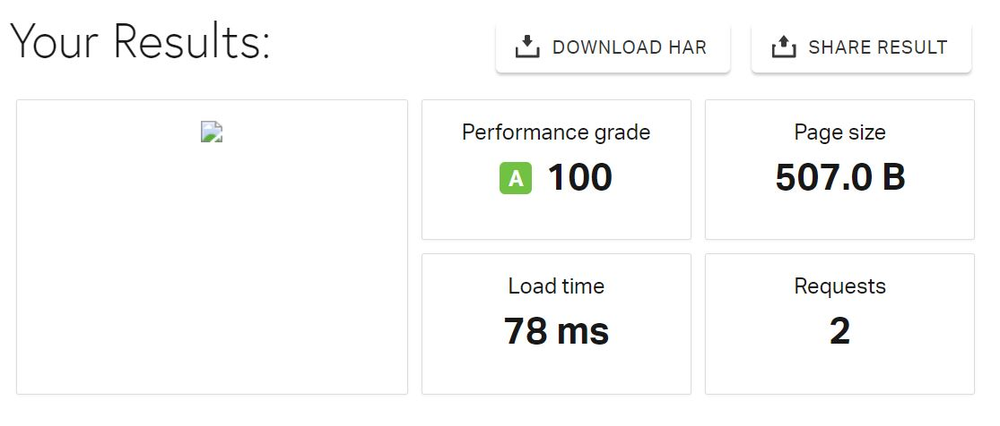
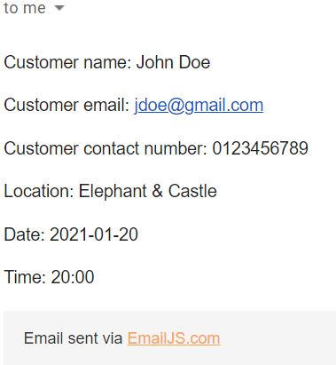

# Testing

## Validation Services
### Validation Services used
* [W3C Markup Validation Service](https://validator.w3.org/) - To validate html code
* [W3C CSS Validation Service](https://jigsaw.w3.org/css-validator/) - To validatate CSS code
* [JS Hint](https://jshint.com/) - To validate JavaScript code

### Errors / Warnings found by W3C Markup Validation Service:
- Errors:
- Warnings: 

### Errors / Warnings found by W3C CSS Validation Service:
- Errors:
- Warnings: 

### Errors / Warnings found by JS Hint:
- Errors:
- Warnings: 

## Speed Testing
[Pingdom.com](https://tools.pingdom.com/) was used to test the load time of the website.
The following results and recommendations were obtained:

      
## Testing User Stories 
1.	As a user, I want to learn more about the café, and read some background information to get a feel for the company.
    * Upon entering the site the first thing the user sees is an image of one of the cafe locations interiors, with the cafe logo placed over this. This gives the user an immediate feel for the cafe chain and the logo makes use of branding practices.
    * The first thing the user sees once they scroll past the hero image is the 'About Us' section - which provides more information on the story behind the cafe, the cafe owners and the team.
    * The 'About Us' section is accesible through the navbar at all times.

2.	As a user, I want to view the cafes menu and see what items are on offer for breakfast, lunch, drinks and dessert at the café.
    * The 'Menu' section is also accesible through the navbar which means the user can always view the menu at a click.
    * The Menu makes use of tabs to allow the user to easily see what menu items are available for the purpose of their cafe visit (Breakfast/lunch/drinks/desserts)
    * This means that if the user is visiting the cafe for lunch, they can easily select the 'Lunch' tab, rather than scrolling through all items offered.
    * Menu item prices are also included, so that the user can easily get an idea of pricing.
3.	As a user, I want to see where the cafes are located on a map. I want to be able to see the cafes exact location so that I can decide which one I would like to visit. I would also like to be able to obtain contact information for each cafe location.
    * The 'Locations' section makes use of Google Maps API to provide a responsive map with a marker for each location.
    * When a location marker is clicked on by the user, an info window pops up with more information about that location - Cafe address and contact number.
4.	As a user, I want to be able to be able to contact the company to reserve a table. I would like to be able to select the cafe location convenient for me, and then select my preffered date and time.
    * The 'Book a Table' section provides a form for the user to fill out to book a table.
    * The form prompts the user to fill in their name, email address, contact number, preferred location, date and time.
    * If the user tries to submit the form without filling out any of the inputs, they receive customised error messages explaining that this information is needed to book a table.
    * Upon submitting the form the user receives a notification explaining that Wholesome Kitchen will review their booking request and get back to them within 24 hours.

## Manual testing of all elements and functionality 
1. Navigation bar
    * On screen sizes with a width of **990px and above,** the navigation bar appears as a fixed top with 5 visible links to each section of the page.
    * This was tested by manually clicking each link and ensuring it led to the corrent section of the page.
    * Upon testing I noticed that top-padding was needed on each section due to the fixed-top navigation bar using up space on the page. I added top padding of 30px to each main section to fix this issue.
    * On screen sizes **below 990px** the navigation bar collapses into a navbar-toggler button with a burger icon.
    * I tested this using chrome developer tools - changing screen size to various sizes below 990px, and using various different devices.
    * I clicked on the toggler button to ensure the dropdown menu opened.
    * Once the menu opened, I clicked on each link to ensure it led to the correct section of the page.
    * During testing I noticed that when a link was clicked the menu stayed open, meaning the user had to select the menu icon again to close the menu. I decided to add some jQuery to ensure the menu closed upon a link being selected as this led to a more smooth user experience.
2. About Us Section
    * On large and medium screen sizes, the 3 paragraphs in the About Us section have an on scroll event.
    * This was manually tested by ensuring that when I scrolled down 250px, 600px, 800px - the corresponding paragraphs faded in.
    * On testing the responsiveness of the About Us section using Chrom developer tools, I noticed the sectio looked better on small screen sizes without the 3 circular images. I decided to only show the images on medium and large screen sizes (above 768px)

3. Menu Section 
    * The menu section was manually tested by selecting each of the 4 tab headers to unsure they work.
    * I also ensured that each tab header showed the correct corresponding tab sections, so that the user is viewing the correct menu items for breakfast, lunch etc.

4. Locations Section  
    * To test the locations section, I clicked on each map marker to unsure an infowindow was displayed on click.
    * I ensured that each infowindow displayed the correct information for that location.
    * I tested the responsiveness of the map using chrome developer tools, to ensure the width of the map was 70% on all device sizes.

5. Book a Table Section
    * The Book a Table form utilises EmailJs. Each time a user submits a valid form, an email is sent to my personal email address (If site was not fictional this would be sent to the business owner). I tested this by ensuring I received an email with the form information. Example email can be seen below:
    
    * The form in this section has form validation to ensure this user submits valid information.
    * Each input was individually tested as follows:
        * Name input - Upon pressing submit with an empty 'Name' field, an error message show and the error class is applied to the input resulting in an exclamtion icon and red border. Once the user has input text and pressed 'Submit', the error message is hidden and the success class is applied to the input - resulting in a green checkmark icon and green border.
        * Email Address input - When the user tries to submit the form without entering an email address, an error message is shown to inform the user that an email address is required. Tested using an invalid email address (e@e.c) - User received error message stating that email address is not valid. Input a valid email address to unsure the input border turned green and the checkmark icon appeared.
        * Contact Number input - Entered empty field to ensure the user received error message. Tested using invalid number (less than 10 digits) to ensure user was informed that contact number must be 10 digits in length. Tested by enter 10-digit long number to ensure success class was added.
        * Date input - Tested by submitting empty input to unsure user receives error message that date is required. Tested after selecting a date that the success class is applied and error message removed. 
        * Time input - Pressed 'Submit' without inputting a time to unsure user was notified that a time was required. Tested again by entering a time and ensuring success class was applied to the input.
6. Pager footer 
    * Social media links in footer were manually tested to enure they led to Facebook's homepage and Instagram's homepage. They were also tested to unsure the pages opened as a new tab to ensure the user could easily navigate back to the cafes site.

7. Scroll to Top button
    * The scroll to top button was tested to a) ensure it appears once the user begins to scroll and b) ensure when clicked on it brings the user to the top of the page as would be expected. 

## Accessability Testing
[WAVE Web Accessability Evaluation Tool](https://wave.webaim.org/) was used to test the accessability of my site.
The following changes were made upon recommendation from WAVE:

* Alt text of main headshot image was made more meaningful.
* Skipped heading ranks were changed to avoid confusion 